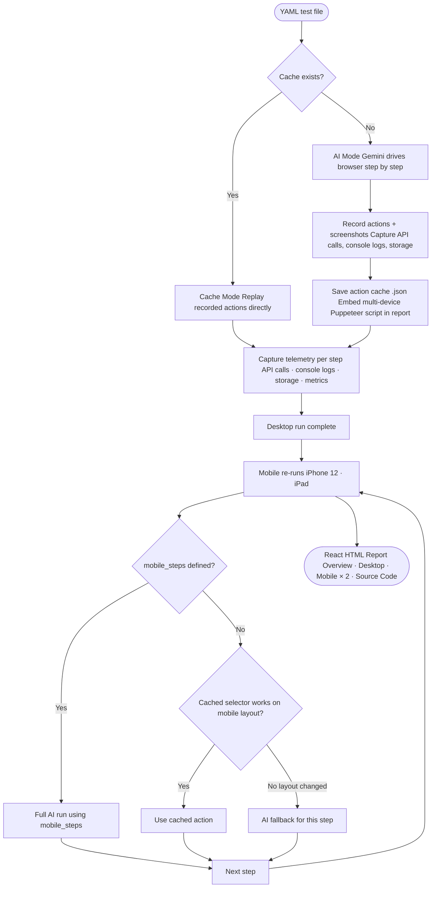

# QAA — Quality Assurance Agent

AI-powered browser testing that writes and replays its own test scripts. Describe tests in plain YAML; QAA uses Gemini to drive the browser on the first run, records every action, then replays them directly on subsequent runs — no AI needed.



---

## Setup

```bash
bun install
```

Copy `.env.example` to `.env` and add your Gemini API key:

```
GEMINI_API_KEY=your_key_here
GEMINI_MODEL=gemini-2.0-flash   # optional, this is the default
BROWSER_PATH=/path/to/chrome    # optional, auto-detected
```

Run the browser setup wizard to auto-detect installed browsers:

```bash
bun src/index.ts setup
```

---

## Running tests

### Single test

```bash
bun src/index.ts tests/example.yaml
```

### Multiple tests in parallel

Pass multiple YAML paths — each runs in its own process with its own browser instance simultaneously:

```bash
bun src/index.ts tests/signup.yaml tests/checkout.yaml tests/search.yaml
```

Each test runs completely independently. Results are buffered and printed sequentially once all tests finish, with a pass/fail summary at the end.

> **Note:** Each parallel test opens its own browser instance. Running many tests simultaneously uses proportionally more memory and CPU.

### Other commands

To force a fresh AI run (clears cached actions):

```bash
bun src/index.ts clear tests/example.yaml
bun src/index.ts tests/example.yaml
```

To serve the latest report over HTTP:

```bash
bun src/index.ts serve github-search
```

Omit the slug to serve the most recently generated report. Then open `http://localhost:4321/` in your browser.

---

## Writing tests

```yaml
name: "GitHub Search"
steps:
  - Navigate to https://github.com
  - Click the search input at the top of the page
  - Type "oven-sh/bun" into the search field
  - Press Enter to submit the search
  - Verify the search results page loaded and shows repository results
```

Steps are plain English. The AI interprets them and chooses the right browser actions. Use "verify" or "check" in a step to make it an assertion.

If a step cannot be completed (e.g. a button doesn't exist on the page), the AI responds with `FAIL: <reason>` and the step is recorded as failed in the report.

### Mobile-specific steps

Some flows differ significantly on mobile (e.g. navigation hidden behind a hamburger menu). Define a `mobile_steps` list to run an entirely different sequence on mobile viewports instead of replaying the desktop cache:

```yaml
name: "GitHub Search"
steps:
  - Navigate to https://github.com
  - Click the search input at the top of the page
  - Type "oven-sh/bun" into the search field
  - Press Enter to submit the search
  - Verify the search results page loaded and shows repository results

mobile_steps:
  - Navigate to https://github.com
  - Click the hamburger menu icon
  - Click the Search link in the navigation
  - Type "oven-sh/bun" into the search field
  - Press Enter to submit the search
  - Verify the search results page loaded and shows repository results
```

When `mobile_steps` is present, all mobile viewport re-runs use full AI with those steps (no cache). When absent, mobile re-runs fall back to the hybrid cached-then-AI approach.
