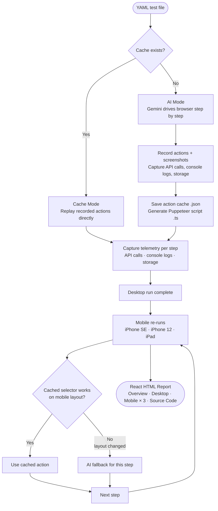

# QAA — Quality Assurance Agent

AI-powered browser testing that writes and replays its own test scripts. Describe tests in plain YAML; QAA uses Gemini to drive the browser on the first run, records every action, then replays them directly on subsequent runs — no AI needed.

---

## How it works



**Mobile re-runs** happen automatically after each desktop run. Cached selectors are tried first; if a step fails due to layout changes (different button labels, collapsed menus, etc.) the AI takes over for that specific step.

---

## Setup

```bash
bun install
```

Copy `.env.example` to `.env` and add your Gemini API key:

```
GEMINI_API_KEY=your_key_here
GEMINI_MODEL=gemini-2.0-flash   # optional, this is the default
BROWSER_PATH=/path/to/chrome    # optional, auto-detected
```

Run the browser setup wizard to auto-detect installed browsers:

```bash
bun src/index.ts setup
```

---

## Running tests

```bash
bun src/index.ts tests/example.yaml
```

To force a fresh AI run (clears cached actions):

```bash
bun src/index.ts clear tests/example.yaml
bun src/index.ts tests/example.yaml
```

---

## Writing tests

```yaml
name: "GitHub Search"
steps:
  - Navigate to https://github.com
  - Click the search input at the top of the page
  - Type "oven-sh/bun" into the search field
  - Press Enter to submit the search
  - Verify the search results page loaded and shows repository results
```

Steps are plain English. The AI interprets them and chooses the right browser actions. Use "verify" or "check" in a step to make it an assertion.

---

## Report

After each run a self-contained HTML report is saved to `reports/`. Open it in any browser.

The report is a **React SPA** with the following pages:

| Page | Description |
|------|-------------|
| **Overview** | Summary cards for desktop + each mobile viewport, step pass/fail matrix |
| **Desktop Run** | Step-by-step results with screenshots |
| **iPhone SE** | Mobile replay at 375×667 |
| **iPhone 12** | Mobile replay at 390×844 |
| **iPad** | Mobile replay at 768×1024 |
| **Source Code** | Generated Puppeteer TypeScript script |

Each step card shows:
- Screenshot of the page after the step
- **API Calls** — every XHR/fetch with method, URL, status code, request payload, and response body
- **Console Logs** — all `console.log/warn/error/info` output with level colour-coding
- **Storage & Cookies** — snapshot of `localStorage`, `sessionStorage`, and cookies at step completion
- **AI Assisted** badge (mobile only) — shown when the AI had to intervene because the cached selector didn't work on mobile

---

## Generated script

On a successful first AI run a Puppeteer TypeScript script is saved to `generated/<test-name>.ts`. It can be run independently:

```bash
bun generated/my-test.ts
```

---

## Project structure

```
src/
  index.ts          CLI entry point + setup wizard
  yaml-runner.ts    Test orchestration, mobile re-runs, report generation
  browser.ts        Puppeteer automation + telemetry capture (API, console, storage)
  ai.ts             Gemini API client with rate-limit handling
  report.ts         React CDN SPA report generator
  code-generator.ts Converts recorded actions to TypeScript/Puppeteer
  prompt.ts         System prompt for the AI
  Tools.ts          AI tool definitions
  types.ts          Shared TypeScript interfaces
tests/
  example.yaml      Example test case
generated/          Cached actions (.json) + generated scripts (.ts)
reports/            HTML test reports
```

---

## Environment variables

| Variable | Required | Description |
|----------|----------|-------------|
| `GEMINI_API_KEY` | Yes | Google Gemini API key |
| `GEMINI_MODEL` | No | Model ID (default: `gemini-2.0-flash`) |
| `BROWSER_PATH` | No | Path to Chrome/Brave/Edge binary (auto-detected) |

---

## Requirements

- [Bun](https://bun.sh) v1.0+
- A Chromium-based browser (Chrome, Brave, Edge, Arc, Chromium)
- Gemini API key — free tier works with the built-in rate limiter
