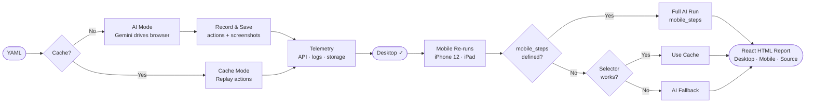

# QAA — Quality Assurance Agent

AI-powered browser testing that writes and replays its own test scripts. Describe tests in plain YAML; QAA uses Gemini to drive the browser on the first run, records every action, then replays them directly — no AI needed on repeat runs.

## How it works




## Setup

```bash
bun install
```

Copy `.env.example` to `.env` and fill in your key:

```env
GEMINI_API_KEY=your_key_here
GEMINI_MODEL=gemini-2.0-flash   # optional
BROWSER_PATH=/path/to/chrome    # optional, auto-detected
```

Run the browser setup wizard:

```bash
bun src/index.ts setup
```

## Running tests

| Command | Description |
|---|---|
| `bun src/index.ts tests/example.yaml` | Single test |
| `bun src/index.ts tests/a.yaml tests/b.yaml` | Parallel tests (own browser per test) |
| `bun src/index.ts clear tests/example.yaml` | Clear cache, force fresh AI run |
| `bun src/index.ts serve github-search` | Serve latest report at `localhost:4321` |

> **Note:** Each parallel test opens its own browser instance — memory/CPU scales with test count.


## Writing tests

```yaml
name: "TodayTodo Signup Test"
steps:
  - Navigate to https://thetodaytodo.netlify.app/auth/signin
  - Click the signup button to go to the signup page
  - Create an account with a unique email and password starting with "abc"
```

Steps are plain English. Use **"verify"** or **"check"** to make a step an assertion. If a step fails (e.g. element not found), the AI responds with `FAIL: <reason>` and it's recorded in the report.

### Mobile-specific steps

```yaml
mobile_steps:
  - Tap the hamburger menu
  - Tap Sign Up
  - Fill in email and password
```

When `mobile_steps` is present, all mobile viewport runs use full AI with those steps. When absent, mobile falls back to the hybrid cached-then-AI approach.
