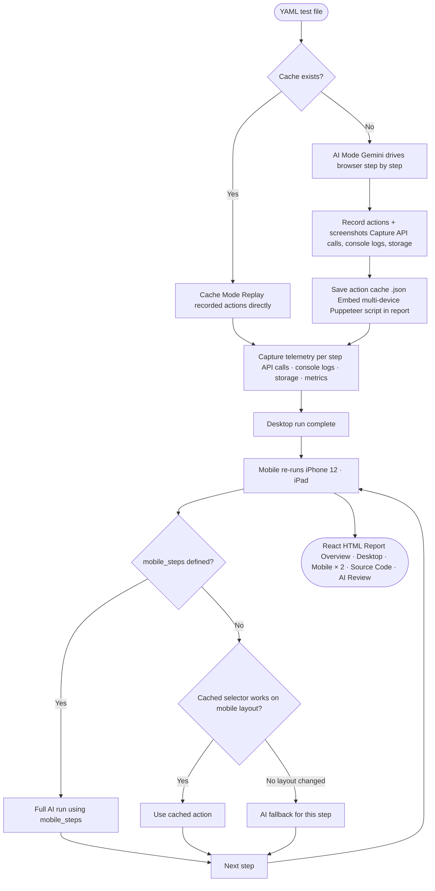

# QAA — Quality Assurance Agent

AI-powered browser testing that writes and replays its own test scripts. Describe tests in plain YAML; QAA uses Gemini to drive the browser on the first run, records every action, then replays them directly on subsequent runs — no AI needed.

---

## How it works



**Mobile re-runs** happen automatically after each desktop run. By default, cached selectors are tried first; if a step fails (layout change, collapsed menu, etc.) the AI takes over for that step. If `mobile_steps` is defined, all mobile steps run with full AI using that separate step list.

---

## Setup

```bash
bun install
```

Copy `.env.example` to `.env` and add your Gemini API key:

```
GEMINI_API_KEY=your_key_here
GEMINI_MODEL=gemini-2.0-flash   # optional, this is the default
BROWSER_PATH=/path/to/chrome    # optional, auto-detected
```

Run the browser setup wizard to auto-detect installed browsers:

```bash
bun src/index.ts setup
```

---

## Running tests

```bash
bun src/index.ts tests/example.yaml
```

To force a fresh AI run (clears cached actions):

```bash
bun src/index.ts clear tests/example.yaml
bun src/index.ts tests/example.yaml
```

To serve the latest report over HTTP (required for the AI Review feature):

```bash
bun src/index.ts serve github-search
```

Omit the slug to serve the most recently generated report. Then open `http://localhost:4321/` in your browser.

---

## Writing tests

```yaml
name: "GitHub Search"
steps:
  - Navigate to https://github.com
  - Click the search input at the top of the page
  - Type "oven-sh/bun" into the search field
  - Press Enter to submit the search
  - Verify the search results page loaded and shows repository results
```

Steps are plain English. The AI interprets them and chooses the right browser actions. Use "verify" or "check" in a step to make it an assertion.

If a step cannot be completed (e.g. a button doesn't exist on the page), the AI responds with `FAIL: <reason>` and the step is recorded as failed in the report.

### Mobile-specific steps

Some flows differ significantly on mobile (e.g. navigation hidden behind a hamburger menu). Define a `mobile_steps` list to run an entirely different sequence on mobile viewports instead of replaying the desktop cache:

```yaml
name: "GitHub Search"
steps:
  - Navigate to https://github.com
  - Click the search input at the top of the page
  - Type "oven-sh/bun" into the search field
  - Press Enter to submit the search
  - Verify the search results page loaded and shows repository results

mobile_steps:
  - Navigate to https://github.com
  - Click the hamburger menu icon
  - Click the Search link in the navigation
  - Type "oven-sh/bun" into the search field
  - Press Enter to submit the search
  - Verify the search results page loaded and shows repository results
```

When `mobile_steps` is present, all mobile viewport re-runs use full AI with those steps (no cache). When absent, mobile re-runs fall back to the hybrid cached-then-AI approach.

---

## Report

After each run a self-contained HTML report is saved to `reports/`. Open it in any browser.

The report is a **React SPA** with the following pages:

| Page | Description |
|------|-------------|
| **Overview** | Summary cards for desktop + each mobile viewport, step pass/fail matrix |
| **Desktop Run** | Step-by-step results with screenshots |
| **iPhone 12** | Mobile replay at 390×844 |
| **iPad** | Mobile replay at 768×1024 |
| **Source Code** | Generated multi-device Puppeteer TypeScript script |
| **AI Review** | Gemini analysis of the report for security, performance, and test integrity issues |

Each step card shows:
- Screenshot of the page after the step
- **Metrics** — step wall-clock duration, page load time, DOMContentLoaded time, JS heap usage
- **API Calls** — every XHR/fetch with method, URL, status code, request payload, and response body *(desktop only)*
- **Console Logs** — all `console.log/warn/error/info` output with level colour-coding *(desktop only)*
- **Storage & Cookies** — snapshot of `localStorage`, `sessionStorage`, and cookies at step completion *(desktop only)*
- **AI Assisted** badge (mobile only) — shown when the AI had to intervene because the cached selector didn't work on mobile

The **AI Review** page analyses the entire report and flags:
- Security concerns (credentials in URLs, plain HTTP endpoints, sensitive data in API payloads)
- Performance issues (slow page loads, high JS heap usage, excessive API calls per step)
- Test integrity issues (steps that passed but likely didn't achieve their goal)
- Root causes for failed steps

> **Note:** The AI Review button requires the report to be served over HTTP. Open-from-disk (`file://`) blocks outbound fetch requests. Use `bun src/index.ts serve <slug>` to start a local server.

---

## Generated script

On a successful first AI run a multi-device Puppeteer TypeScript script is **embedded in the report** and can be downloaded from the Source Code page. It contains three device functions:

- `runDesktop()` — full viewport, desktop user-agent
- `runIPhone12()` — 390×844, mobile viewport + touch
- `runIPad()` — 768×1024, mobile viewport + touch

The `.ts` file in `generated/` is deleted after the report is created; the `.json` cache is kept for subsequent replays.

---

## Verbose / LLM training data

Every time the AI executes a step, QAA appends one entry to a JSONL file in `verbose/` in [Alpaca format](https://github.com/tatsu-lab/stanford_alpaca#data-release):

```json
{"instruction": "<system prompt>", "input": "Execute this test step: <step>", "output": "<AI summary>"}
```

This lets you accumulate labelled training data to fine-tune a smaller model to replace Gemini.

---

## Project structure

```
src/
  index.ts          CLI entry point + setup wizard
  yaml-runner.ts    Test orchestration, mobile re-runs, report generation
  browser.ts        Puppeteer automation + telemetry + page metrics
  ai.ts             Gemini API client with rate-limit handling
  report.ts         React CDN SPA report generator
  code-generator.ts Converts recorded actions to multi-device Puppeteer script
  prompt.ts         System prompt for the AI (includes FAIL: convention)
  verbose.ts        Alpaca-format JSONL logger for LLM training data
  Tools.ts          AI tool definitions
  types.ts          Shared TypeScript interfaces
tests/
  example.yaml      Example test case
generated/          Action cache (.json) — .ts files deleted after report creation
reports/            HTML test reports
verbose/            Alpaca JSONL files for LLM training data
```

---

## Environment variables

| Variable | Required | Description |
|----------|----------|-------------|
| `GEMINI_API_KEY` | Yes | Google Gemini API key |
| `GEMINI_MODEL` | No | Model ID (default: `gemini-2.0-flash`) |
| `BROWSER_PATH` | No | Path to Chrome/Brave/Edge binary (auto-detected) |

---

## Requirements

- [Bun](https://bun.sh) v1.0+
- A Chromium-based browser (Chrome, Brave, Edge, Arc, Chromium)
- Gemini API key — free tier works with the built-in rate limiter
